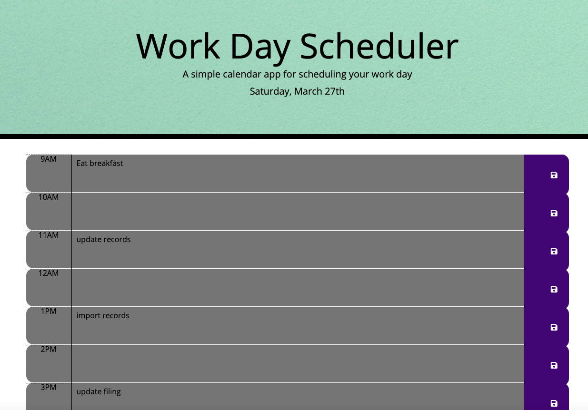
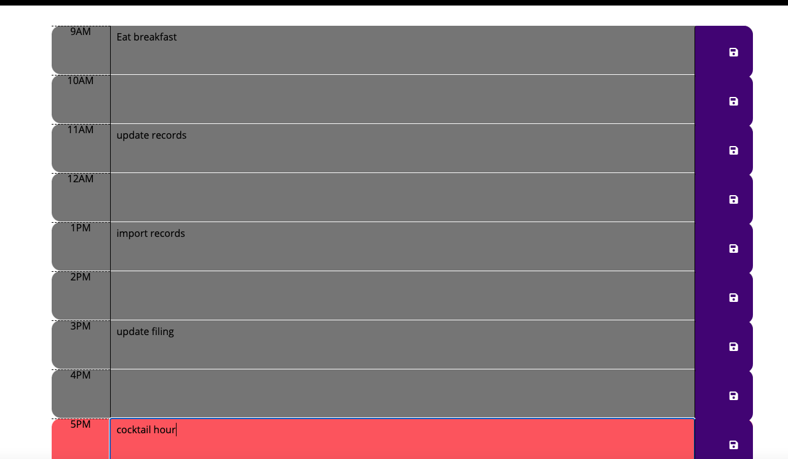

# **daily-planner**

[Link to Website] (https://johnsoncm.github.io/daily-planner/)

****
****

The codebase was developed to create a calendar application that allows the user to save events for each hour of the day. When the save button is clicked - these events are saved in local storage and remain on the page once it is refreshed. 

The time blocks are color coded to indicate past (grey), present (red), and future (green). Moment.js was utilized to display and compare date and times.

Technologies Used:
HTML
CSS
Javascript
jQuery

Contact Info:
Casey Johnson
johnsoncm3@gmail.com
